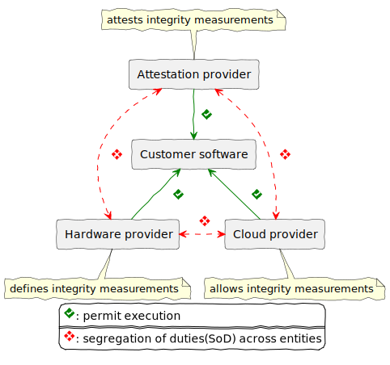

## <!--fit--> Unlocking Confidential Computing~ An Introduction to Confidential Containers in Kubernetes

_For your eyes only or is it_

<!-- _footer: Author: Nino Martinez Wael -->
<!-- _paginate: false -->

---

## Take aways, what will you get from this

1. Understand the fundamentals of confidential computing and why it’s essential for securing sensitive workloads in cloud-native environments.
2. Learn how Confidential Containers integrate with Kubernetes to provide hardware-backed isolation and attestation without disrupting existing workflows.
3. Discover practical use cases and next steps for adopting CoCo in real-world scenarios, from AI/ML to regulated industries.

---

### Introduction

<!-- 5 min introduction of this talk -->
<!--
Let's start by presenting myself
* I'm Nino Martinez Wael
* I'm from Denmark
* I work as a Principal Software Engineer at TDC Erhverv Data Security & Data Privacy
* I've joined the confidential container project as contributer in august and have been working with Confidential compute since 2022 
* I've been a proffesional since 2002, and contributing to opensource projects since 2006.
-->

---

## Welcome & agenda

1) _Scope of talk_
1) _Confidential Computing Basics_
1) _Confidential Computing Basics_

<!-- 
Im honored to be able to speak to you guys on this topic.
This talk wil on a introduction level to keep it within the timeframe.
 -->

---

### <!--fit--> Confidential Computing Basics

1) _Scope_
2) _Secure Data-in-Use_
3) _Enable Trusted Collaboration_
4) _Drive Universal Adoption_

<!--
20 min

1. _Secure Data-in-Use_: Secure Data-in-Use represents a transformative approach to data protection, ensuring that sensitive information remains encrypted and isolated while being processed in memory and on cpu, by leveraging hardware-based Trusted Execution Environments (TEEs) that create secure enclaves that are locked down.

2. _Enable Trusted Collaboration_: Enable Trusted Collaboration by providing verifiable evidence for a TEE (application) instance. This is also called a quote, a quote consists of Platform Configuration Register measurements (PCR) which essentially are HASH'es of information like cpuid's etc. So validating a quote consisting of PCR measurements for a TEE on a 3rd party level is called Remote attestation or RATS.

3. _Drive Universal Adoption_: Early attempts on creating TEE's were quite invasive and often required either reconfiguration of the runtime or complete reimplementation, TEE's of this kind were processbased. A more adoption firendly approach are making the TEE vm based, it has a MUCH MUCH larger tcb but are far eaisier to use. 
-->

---

### Confidential Containers Overview

1) _Confidential Containers (CoCo) mission statement_
2) _Architecture & trust model_
3) _Integration with Kata Containers_

<!--  15 min

1. _Confidential Containers (CoCo) mission statement_: Allow cloud native application owners to enforce application security requirements
Transparent deployment of unmodified containers
Support for multiple TEE and hardware platforms
A trust model which separates Cloud Service Providers (CSPs) from guest applications
Least privilege principles for the Kubernetes Cluster administration capabilities which impact delivering Confidential Computing for guest application or data inside the TEE.
2. _Architecture & trust model_:

 -->

---

### Key Features & Workflow

- Trustee, rego policies for
  - Resource access
  - Passing attestation
  - find more
- Pod-centric TEE design via micro vm's
- Hyperscaler CoCo peerpods Flavors (azure,aws,gcp,ibmcloud,alibabacloud...)
- Attestation process
- Developer experience
<!-- 10 min -->

---

### Use Cases & Ecosystem

AI/ML workloads
Multi-tenant environments
Regulated industries
<!-- 10 min -->

---

### Roadmap & How to Get Started

Community resources
Future developments
<!-- 10 min -->

---

## Reference links

- Presentation link --> 

- [Confidential Containers](https://confidentialcontainers.org/)
- [PCR Specification](https://trustedcomputinggroup.org/wp-content/uploads/TCG_PCClient_PFP_r1p05_v22_02dec2020.pdf)

## Q&A (5 min)