# <!--fit--> Unlocking Confidential Computing ~ An Introduction to Confidential Containers in Kubernetes

_For your eyes only or is it_

---

## Key take aways

1) Understand the fundamentals of confidential computing.
1) How CNCF Confidential Containers (**CoCo**) integrate with Kubernetes.
1) Next steps for adopting CoCo.

<!--
time 00:01:00 

Understand the fundamentals of confidential computing and why it’s essential for securing sensitive workloads in cloud-native or on-prem environments.
Learn how Confidential Containers integrate with Kubernetes to provide hardware-backed isolation and attestation without disrupting existing workflows.
Next steps for adopting CoCo.

-->

---

## <!--fit--> Sneak peak of whats needed for workload to run with hardware confidentiality

_Kubernetes snipplet_

```yaml
...
annotations:
    io.katacontainers.config.runtime.cc_init_data: ""
...  
```
<!--
time 00:02:00 

For deployments utilizing CoCo above is all that is needed.
-->

---

## Introduction

1) I'm Nino Martinez Wael, from Denmark, Frederikssund
1) I've been a professional from 2002, contributing to opensource projects from 2006
1) I work as a Chief Architect at TDC Erhverv
1) Joined the CNCF confidential containers as contributer in august 2025, working with Confidential compute since 2022
1) I'm primarily a Java developer, doing RUST for lowlevel implementations

<!--
time 00:04:00  introduction of this talk

Let's start by presenting myself
* I'm Nino Martinez Wael
* I'm from Denmark, Frederikssund
* I work as a Chief Architect at TDC Erhverv Data Security & Data Privacy
* I've joined the confidential container project as contributer in august 2025 and have been working with Confidential compute since 2022 
* I've been a proffesional since 2002, and contributing to opensource projects since 2006.
-->

---

## Welcome & agenda

1) _Scope of talk_
1) _Confidential Computing Basics_
1) _CNCF Confidential Containers Overview_
1) _Q&A_

<!-- 
time 00:06:00
Im honored to be able to speak to you guys on this complex topic.
This talk wil on a introduction level.
We will go through Confidential Computing Basics to get an idea of what this area covers before diving into what CNCF Confidential Containers has to offer. If theres this for it we can take questions per topic, otherwise questions will be at the end. The talk will take around 60 minutes  

 -->

---

## Confidential Computing Basics

1) _Secure Data-in-Use_
1) _Enable Trusted Collaboration_
1) _Drive Universal Adoption_

<!--
time 00:08:00

1. _Secure Data-in-Use_: Secure Data-in-Use represents a transformative approach to data protection, ensuring that sensitive information remains encrypted and isolated while being processed in memory and on cpu, by leveraging hardware-based Trusted Execution Environments (TEEs) that create secure enclaves that are locked down. For 

2. _Enable Trusted Collaboration_: Enable Trusted Collaboration by providing verifiable evidence for a TEE (application) instance. This is also called a quote, a quote consists of Platform Configuration Register measurements (PCR) which essentially are HASH'es of information like cpuid's etc. So validating a quote consisting of PCR measurements for a TEE on a 3rd party level is called Remote attestation procedure or RATS.

3. _Drive Universal Adoption_: Early attempts on creating TEE's were quite invasive and often required either reconfiguration of the runtime or complete reimplementation, TEE's of this kind were processbased. A more adoption firendly approach are making the TEE vm based, it has a MUCH MUCH larger tcb (Trusted Compute base) but are far eaisier to use. 
-->

---

## <!--fit--> Confidential Computing Basics - Attestation

1) _Idea behind attestation_ 
<!--
time 00:12:00
 Talk on attestation / RATS
-->
---

## Confidential Containers Overview

1) _CNCF Confidential Containers (CoCo) mission statement_
1) _Architecture & trust model_ 
<!-- _footer: "" -->
<!--  
time 00:18:00

1. _Confidential Containers (CoCo) mission statement_: Allow cloud native application owners to enforce application security requirements
 - Transparent deployment of unmodified containers
 - Support for multiple TEE and hardware platforms (including nvidia)
A trust model which separates Cloud Service Providers (CSPs) from guest applications
Least privilege principles for the Kubernetes Cluster administration capabilities which impact delivering Confidential Computing for guest application or data inside the TEE.
2. _Architecture_:
Built of OSS compontents such as Kata Containers, LibVirt with a modular approach so components can be reused across Cloud Service Providers. Custom built vm's for Cloud Service Providers.
 -->
---

## Key Features CoCo TEE (Pod creation)

1) Kubecentric, mindset
1) CoCo configuration defined via kubernetes annotations
1) Pod-centric TEE design via lightweight vm's
1) Cloud Service Provider CoCo peerpod Flavors (Azure, AWS, GCP, IBMcloud, Alibaba Cloud...)
1) OCI image signature verification / multi key encryption support
1) Attestation process
1) In TEE endpoints for attestation or secured resources

<!-- 
time 00:25:00

Confidential computing projects are largely defined by what is inside the enclave and what is not. For Confidential Containers, the enclave contains the workload pod and helper processes and daemons that facilitate the workload pod. Everything else, including the hypervisor, other pods, and the control plane, is outside of the enclave and untrusted. This division is carefully considered to balance TCB size and sharing.

Cloud Service Provider CoCo peerpod Flavors = Cloud Api adaptor, manages pod life cycle from creation of a complete VM to destruction.

It's first after a successful attestation that workload begins to start.

-->
---

## Activate CoCo

```yaml
annotations:
    io.katacontainers.config.runtime.cc_init_data: ""
```
<!-- 
time 00:26:00

simple as that:)
-->
---

## InitData CoCo, source of truth

1) Configuration of Attestation hashed and validated
1) [Attestation agent config](https://github.com/confidential-containers/guest-components/blob/main/attestation-agent/attestation-agent/config.example.toml)
1) [Kata containers policy](https://github.com/kata-containers/kata-containers/blob/dacb14619d9a4e1927ba64be09b89773c5d54d5e/src/tools/genpolicy/genpolicy-auto-generated-policy-details.md)
1) [OCI Image policy](https://github.com/confidential-containers/guest-components/blob/main/confidential-data-hub/example.config.toml#L105) [spec](https://github.com/containers/image/blob/main/docs/containers-policy.json.5.md)
1) [OCI Registry Auth credentials](https://github.com/confidential-containers/guest-components/blob/main/confidential-data-hub/example.config.toml#L121) [spec](https://github.com/confidential-containers/guest-components/blob/main/image-rs/docs/ccv1_image_security_design.md#policy)
1) [OCI Registry Configuration policy](https://github.com/confidential-containers/guest-components/blob/54b9a5b4e5a323c3d099940ba0f9a062b5722e42/image-rs/docs/ccv1_image_security_design.md#policy) [spec](https://github.com/confidential-containers/guest-components/blob/main/image-rs/docs/registry_configuration.md)
1) [Additional credentials pulled from Trustee](https://github.com/confidential-containers/guest-components/blob/main/confidential-data-hub/example.config.toml#L58-L60)
1) Much more

<!-- 
time 00:32:00

Init data describes:
Who will attest this deployment
Kata containers, Pod access permissions and what can the pod access of hardware amongst other things. Kata GenPolicy tool.
What are allowed container registries, allowed signatures etc.

-->
---

## CoCo TEE continued


<!-- 
time 00:35:00
Point out that the containers running in the pod TEE share memory unrestricted, mention that Kata containers only permits access to specified devices / along with specified kubernetes capabilities if no exec permit no admin can enter the pod.
Mention guest puller as all non vm specific images are pulled inside TEE.

-->

---

<style scoped>
ul {
  font-size: 0.6em;
}
</style>

## Key Features CoCo Trustee (Attestation)

1. Attestation
1. Resources
1. Rego policies
    - Premade configurable hardware attestation
    - Resource access
1. Supports optional plugins
    - HSM
    - KMS Aliyun
    - Vault
    - Nebula CA

<!-- 
time 00:38:00

Secure key release flow, sealed secrets

-->

---

## How to Get Started

1) Currently CoCo can be deployed as OLM's, transitioning towards HELM charts.
1) Guides on official website for the different cloudproviders (Azure, GCP, AWS & Bare metal)
1) CoCo Trustee can be deployed as OLM's, transitioning towards HELM charts. Or simply a single container

<!-- 
time 00:40:00

-->

---

## Reference links


- [CoCo Web](https://confidentialcontainers.org/)
- [CoCo Slack](https://cloud-native.slack.com/archives/C039JSH0807)
- [KataContainers](https://katacontainers.io/) [GenPolicy](https://github.com/kata-containers/kata-containers/tree/main/src/tools/genpolicy)
- [PCR (measurements) Spec](https://trustedcomputinggroup.org/wp-content/uploads/TCG_PCClient_PFP_r1p05_v22_02dec2020.pdf)
- [LibVirt](https://libvirt.org/)
- Questions -> <nmwa@tdc.dk>

---

## Q&A (5 min)
